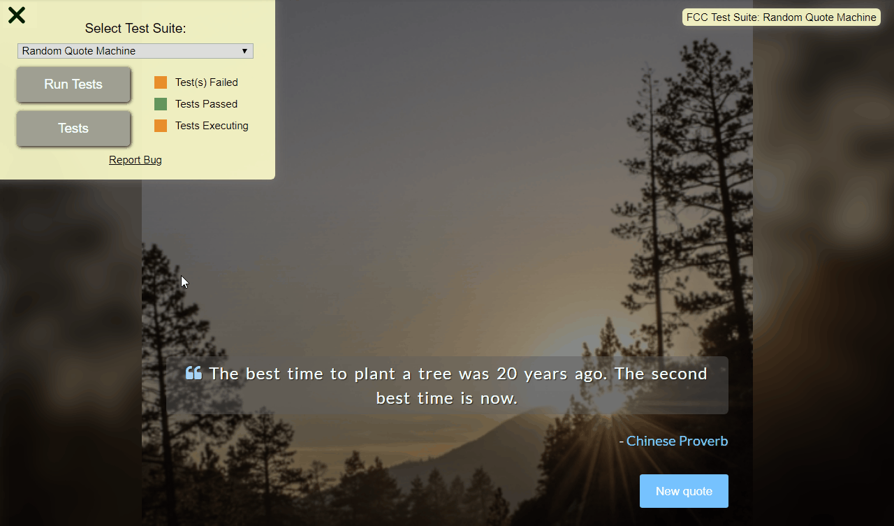

# Quote Machine
### About the project

it's a freecodecamp project in the "Front End Libraries Projects" module, you have to build a Quote machine.  

### Tools used

**Front-end:** React

### Screenshot



### Link

https://codepen.io/B-Tarik/full/drbXqO

### User stories

1. I can see a wrapper element with a corresponding ```id="quote-box"```.
2. Within ```#quote-box```, I can see an element with a corresponding ```id="text"```.
3. Within ```#quote-box```, I can see an element with a corresponding ```id="author"```.
4. Within ```#quote-box```, I can see a clickable element with a corresponding ```id="new-quote"```.
5. Within ```#quote-box```, I can see a clickable element with a corresponding ```id="tweet-quote"```.
6. On first load, my quote machine displays a random quote in the element with ```id="text"```.
7. On first load, my quote machine displays the random quote's author in the element with ```id="author"```.
8. When the ```#new-quot``` button is clicked, my quote machine should fetch a new quote and display it in the ```#text``` element.
9. My quote machine should fetch the new quote's author when the ```#new-quote``` button is clicked and display it in the ```#author``` element.
10. I can tweet the current quote by clicking on the ```#tweet-quote``` a element. This a element should include the "twitter.com/intent/tweet" path in it's href attribute to tweet the current quote.
11. The ```#quote-box``` wrapper element should be horizontally centered. Please run tests with browser's zoom level at 100% and page maximized.
